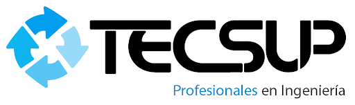

## OrbytaX - Proyecto final de Aplicaciones Web

OrbytaX es un sistema de e-commerce especializado en la venta de periféricos y accesorios gamer, que incluye funcionalidades como catálogo de productos, carrito de compras, sistema de usuario, favoritos y gestión de pedidos.

Actualmente (v0.1), el sistema se encuentra en una fase temprana de desarrollo. Muchas funcionalidades planificadas inicialmente en el diseño no llegaron a implementarse.

## Tecnologías utilizadas (v0.1):

● Backend: Laravel (PHP)
● Frontend: Vite + CSS personalizado
● Base de datos: MySQL
● Estilos: CSS futurista personalizado

## Contribuciones

- [toko0715](https://github.com/toko0715):
Desarrollador principal. Implementación de toda la lógica funcional del sistema. Adaptación de la plantilla HTML a Blade, integración de Vite con CSS/JS, creación y conexión con base de datos (migraciones, relaciones, modelos), desarrollo de controladores y rutas, manejo de sesiones, validaciones y flujo de autenticación. Desarrollo completo del carrito de compras, favoritos y sistema de pedidos.

- [DalexisHub](https://github.com/DalexisHub):
Diseño inicial de la interfaz en Figma. Maquetación en HTML, CSS y JavaScript vanilla.

## ¿Y ahora qué?
El proyecto está a la espera de nuevas funcionalidades, mejoras en el diseño responsivo, validaciones más estrictas y una posible integración con pasarelas de pago.

## ¡Gracias por leer!